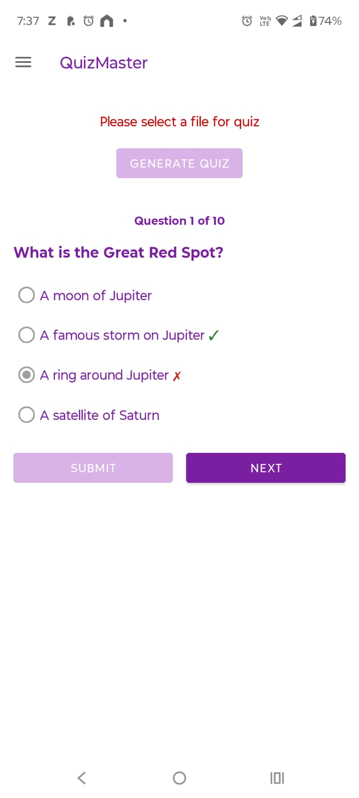
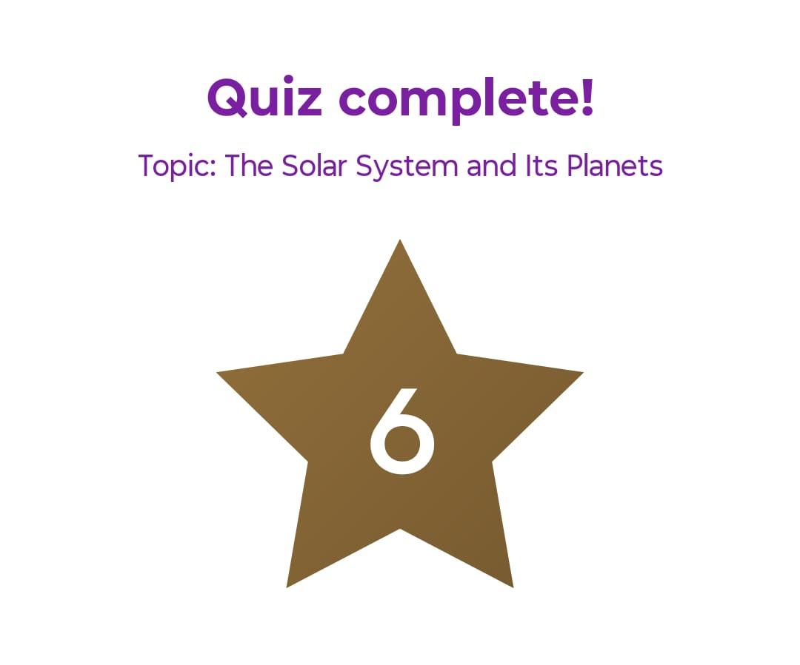

# QuizMaster

An Android app that turns a document into a multiple-choice quiz. Pick a plain-text or PDF file, and QuizMaster uses Claude (via the Anthropic API) to generate questions drawn only from that document.

## Features

- **Text and PDF input.** PDFs are parsed on-device with [PdfBox-Android](https://github.com/TomRoush/PdfBox-Android). Claude then removes headers, footers, page numbers and other layout noise from the extracted text.
- **Question pools.** Each document gets a pool of 20 questions, each with 4 choices. Every quiz attempt draws 10 of them at random and shuffles the answer order.
- **Caching.** Files are identified by a SHA-256 hash of their contents, so the same document is recognized even when the picker returns a different URI. Question pools and cleaned PDF text are cached, which means retaking a quiz doesn't make any API calls.
- **Previous quizzes.** Cached quizzes are listed on the home screen, where you can retake or delete them.
- **Score sharing.** Share a screenshot of your result from the completion screen.
- **Secure key storage.** Your Anthropic API key is stored with `EncryptedSharedPreferences` (AES-256).

## Requirements

- Android 8.0 (API 26) or later; the app targets API 35
- JDK 21
- Android SDK (the Makefile assumes `~/Library/Android/sdk`)
- An [Anthropic API key](https://console.anthropic.com/)

## Building and running

The `Makefile` wraps Gradle and `adb`:

| Command             | What it does                                                       |
|---------------------|--------------------------------------------------------------------|
| `make build`        | Build the debug APK (`./gradlew assembleDebug`)                    |
| `make install`      | Build and install on the connected device                          |
| `make run`          | Build, install and launch on the connected device                  |
| `make run-emulator` | Start the `simulator_api34` AVD if it isn't running, then install and launch |
| `make logcat`       | Stream the app's logs                                              |
| `make stop`         | Force-stop the app                                                 |
| `make uninstall`    | Uninstall the app                                                  |
| `make clean`        | Clean build outputs                                                |

To use a different SDK or JDK location, override `ANDROID_HOME` / `JAVA_HOME`:

```sh
make run ANDROID_HOME=/path/to/sdk JAVA_HOME=/path/to/jdk-21
```

> **Note:** `gradle.properties` pins `org.gradle.java.home` to a local macOS JDK path. If your JDK 21 lives somewhere else, update or remove that line.

## Usage

1. Open the navigation drawer and choose **Set API Key**. Enter your Anthropic API key.
2. Choose **Choose File** and select a `.txt` or `.pdf` file.
3. Tap **Generate Quiz**, answer each question and tap **Submit**, then tap **Next**. After you submit, the correct answer gets a ✓, and your choice gets a ✗ if it was wrong.

   

4. On the results screen you can share your score or go back home. **Share Score** sends a screenshot of your result, like the one below. Your quiz stays under **Previous Quizzes**.

   

## Project structure

All source is in `app/src/main/java/com/quizmaster/app/`:

| Class                 | Responsibility                                                          |
|-----------------------|-------------------------------------------------------------------------|
| `MainActivity`        | UI, navigation, and rendering of quiz screens                           |
| `QuizGenerator`       | Hashes the file, checks caches, extracts PDF text, calls `QuizAgent`    |
| `QuizAgent`           | Calls the Anthropic Messages API (quiz generation and PDF text cleanup) |
| `QuizSession`         | State and scoring for a quiz in progress                                |
| `QuizRandomizer`      | Picks questions from the pool and shuffles the choices                  |
| `QuizCacheStore`      | Stores generated question pools, keyed by content hash                  |
| `DocumentTextCache`   | Stores cleaned PDF text, keyed by content hash                          |
| `JsonBlobStore`       | Helper for storing JSON in `SharedPreferences`                          |
| `ApiKeyStore`         | Encrypted storage for the API key                                       |
| `ScoreSharer`         | Captures and shares the results screenshot                              |
| `ScoreStarView`       | Custom view for the score display                                       |
| `QuizQuestion`, `QuizResult`, `QuizSummary`, `PickedFile` | Value types                 |

## Notes

- The model is `claude-haiku-4-5-20251001`, set in `QuizAgent.MODEL`.
- Documents are truncated to 20,000 characters before quiz generation. Raw PDF text is truncated to 60,000 characters before cleanup.
- The number of choices per question (`QuizQuestion.CHOICES_COUNT`) is also hardcoded in `activity_main.xml` and in `MainActivity`. If you change it, update all three places.

## License

Copyright 2026 Dipanjan Bhowmik

Licensed under the [Apache License, Version 2.0](LICENSE).
